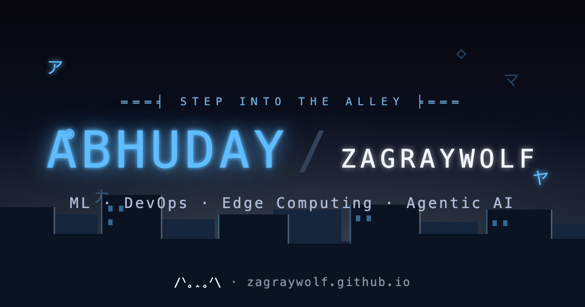
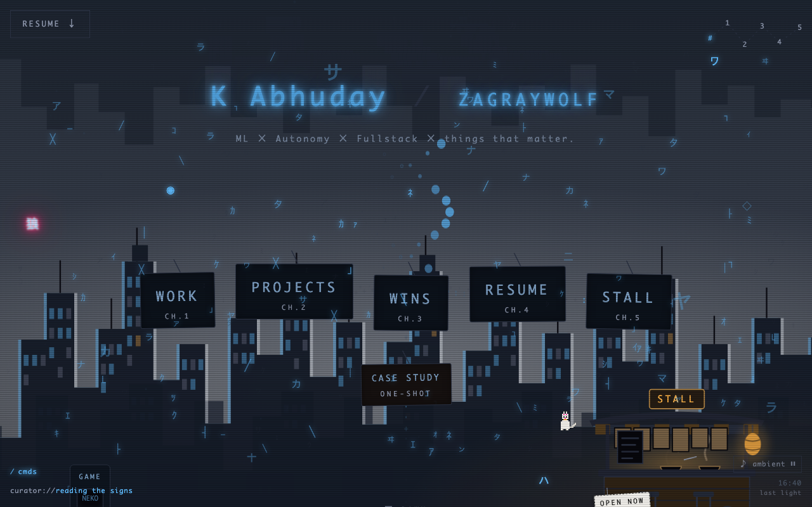
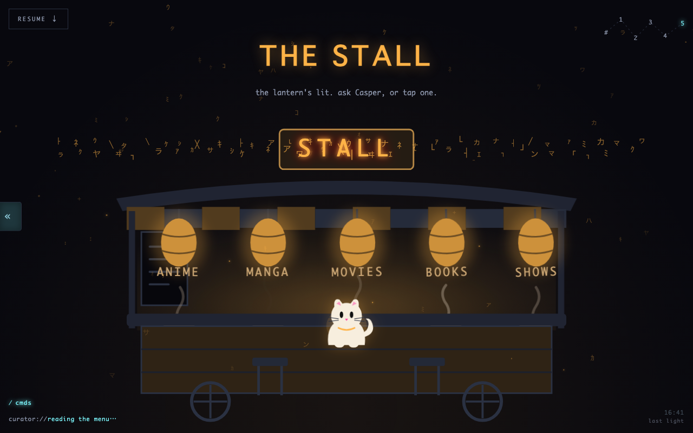
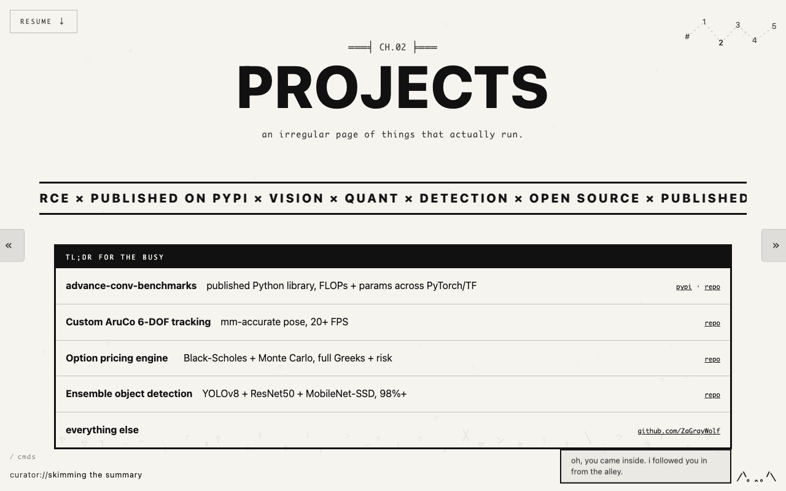
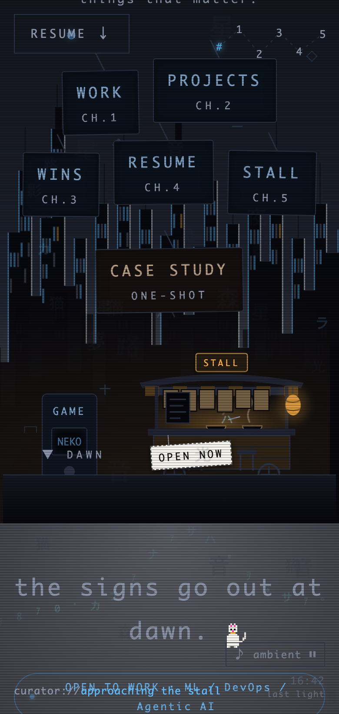

<div align="center">

# ZaGrayWolf

**A night back-alley you can walk through.**

[](https://zagraywolf.github.io)

### [→ step into the alley](https://zagraywolf.github.io)

</div>

---

## What this is

This is my portfolio, but I did not want a portfolio. I wanted a *place*.

So I built a small Tokyo-night alley you can wander. There is a curator made of drifting glyphs that watches your cursor, a white cat named Casper who follows you from room to room, neon signs that are really the navigation, a ramen stall where you can ask for recommendations, and a few things that only wake up if you look for them.

No framework. No build step. No `package.json`. Just HTML, CSS, and vanilla JavaScript that a browser can run straight off disk. Every line is hand-written, and I am a little in love with all of it.

## A look inside


*The hub. The signs are the menu. The cat lives down by the stall.*


*The Stall: a night yatai where Casper hands out recommendations across anime, manga, movies, books and shows.*


*Step into a chapter and the world turns to paper. The curator follows you inside and keeps talking.*

<div align="center">

<br>
<em>On a phone the whole scene restacks and lightens itself, with an ambient glyph wave down low.</em>
</div>

## The chapters

| Room | What waits there |
|------|------------------|
| **The alley** (`/`) | The hub. Parallax ASCII skyline, the curator, the cat, the neon nav. |
| **CH.00 About** | The one quiet room off the alley. Who I am. |
| **CH.01 Work** | Where I have worked, told as job "beats". |
| **CH.02 Projects** | An irregular gallery of things that actually run. |
| **CH.03 Wins** | A scoreboard of the good days. |
| **CH.04 Resume** | The clean version, print-ready, plus a pic-to-ASCII toy. |
| **CH.05 The Stall** | The yatai. Ask Casper, or just tap a lantern. |
| **One-Shot** | A long-form deep dive: edge-inference benchmarks. |
| **404** | Even the lost page has the curator in it, looking confused. |

## How it is built (and why)

I made deliberate choices here, and most of them were about restraint.

- **No framework, no build step.** The whole site is files a browser understands. Clone it, open it, it runs. Nothing to compile, nothing to go stale. I wanted it to still work in ten years.
- **Progressive enhancement, always.** Turn JavaScript off and every word is still readable. The animation is the garnish, never the meal. `prefers-reduced-motion` is honored throughout, so the alley calms right down if you ask it to.
- **One heartbeat.** Every animation shares a single `requestAnimationFrame` loop (`js/ticker.js`). One loop, in sync, cheap. No twelve rogue timers fighting each other.
- **One source of truth for the look.** All color, type, spacing and layering live as tokens in `css/tokens.css`. No magic values scattered around. Change a token, change the world.
- **A living scene, drawn by hand.** The curator, the cat, the comet, the ASCII rivers are all Canvas 2D (`js/curator.js`, `js/cat.js`, `js/meteors.js`, `js/flows.js`). The lo-fi hum on the hub is generative Web Audio (`js/audio.js`), not an mp3.
- **The alley knows what time it is.** `js/timeofday.js` reads your real clock and shifts the sky, so a midnight visit and a noon visit are not the same.
- **A real phone pass.** Phones get a lighter scene, touch-friendly residents, and an ambient glyph wave instead of a cursor-follower that has no cursor to follow.
- **Content lives in data.** The work, projects, wins, recommendations and Casper's little brain are all JSON in `data/`. The pages render themselves from it.
- **Instant updates.** Assets carry a `?v=` cache-buster so a change lands the moment it ships.

## Tech

- HTML5, semantic and accessible (skip links, focus states, ARIA where it earns its keep)
- CSS with custom-property tokens, `color-mix()`, responsive down to small phones
- Vanilla JavaScript, ES modules, zero dependencies
- Canvas 2D for the scene, Web Audio for the sound
- `IntersectionObserver` / `ResizeObserver` for scroll and layout reactions
- A PWA `manifest.webmanifest` (installable; note it is manifest-only, no offline service worker)
- JSON-driven content
- Hosted on GitHub Pages

## Run it locally

ES modules need `http://`, not `file://`, so serve the folder:

```bash
git clone https://github.com/ZaGrayWolf/zagraywolf.github.io
cd zagraywolf.github.io
python3 -m http.server
# then open http://localhost:8000
```

That is it. No install, no dependencies, no build.

## Secrets

There is more in the alley than the nav shows. Pet the cat. Try the `/` key. Some things only wake up if you wander. I am not going to tell you where they are.

## Find me

- GitHub: [@ZaGrayWolf](https://github.com/ZaGrayWolf)
- LinkedIn: [Kunwar Abhuday Singh](https://www.linkedin.com/in/kunwar-abhuday-singh-280836284)
- Kaggle: [@abhuday7](https://www.kaggle.com/abhuday7)
- PyPI: [advance-conv-benchmarks](https://pypi.org/project/advance-conv-benchmarks/)
- Email: abhuday2656@gmail.com

## License

All rights reserved. You are genuinely welcome to read the source, poke around, and learn from it, that is half of why it is public. But please do not lift the design or the site wholesale. This alley is mine, and I built it by hand.

<div align="center">
<sub>Built with too much care by K Abhuday. The cat is called Casper. Be nice to him.</sub>
</div>
